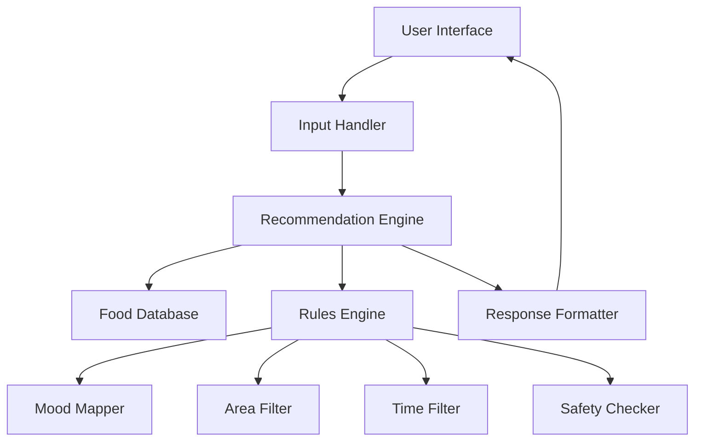

# Design Document: Chennai Street Food Assistant

## Overview

The Chennai Street Food Assistant is a web-based application that provides personalized street food recommendations based on user mood, location area, and time. The system uses a rule-based recommendation engine that processes user inputs against a curated database of Chennai street food knowledge, including mood-food mappings, area specialties, time-based availability, and cultural context.

The application follows a simple input-process-output model with a focus on delivering quick, accurate recommendations through an intuitive user interface that captures the local Chennai vibe.

## Architecture

The system uses a client-server architecture with the following components:



**Frontend**: Single-page web application with responsive design
**Backend**: Node.js/Express server with RESTful API
**Data Layer**: In-memory data structures based on product.md content
**Business Logic**: Rule-based recommendation system

## Components and Interfaces

### 1. User Interface Component
- **Purpose**: Collect user inputs and display recommendations
- **Inputs**: User interactions (mood selection, area selection, time input)
- **Outputs**: Rendered recommendations with local context
- **Key Features**:
  - Dropdown/button selection for mood categories
  - Area selector with Chennai localities
  - Time input (auto-detect or manual)
  - Mobile-responsive design
  - Local Chennai aesthetic

### 2. Input Handler
- **Purpose**: Validate and normalize user inputs
- **Interface**: `processUserInput(mood, area, time) -> ValidatedInput`
- **Validation Rules**:
  - Mood must match predefined categories
  - Area must be from covered localities list
  - Time must be valid 24-hour format
- **Error Handling**: Return validation errors for invalid inputs

### 3. Recommendation Engine
- **Purpose**: Core logic for generating food recommendations
- **Interface**: `generateRecommendations(validatedInput) -> RecommendationList`
- **Process Flow**:
  1. Apply mood-based food mapping
  2. Filter by area specialties
  3. Apply time-based availability rules
  4. Run safety checks
  5. Rank and select top recommendations

### 4. Food Database
- **Purpose**: Store structured food and area data
- **Data Structures**:
  ```typescript
  interface FoodItem {
    name: string;
    category: string;
    moods: string[];
    areas: string[];
    timeSlots: TimeSlot[];
    safetyNotes?: string[];
  }
  
  interface AreaSpecialty {
    area: string;
    timeSlot: string;
    foods: string[];
    notes?: string;
  }
  ```

### 5. Rules Engine
- **Purpose**: Apply business rules for recommendations
- **Components**:
  - **Mood Mapper**: Maps user mood to appropriate food categories
  - **Area Filter**: Applies area-specific food availability
  - **Time Filter**: Filters foods based on time availability
  - **Safety Checker**: Applies safety rules (weather, time-based restrictions)

### 6. Response Formatter
- **Purpose**: Format recommendations with local context and explanations
- **Interface**: `formatResponse(recommendations, context) -> FormattedResponse`
- **Features**:
  - Friendly, local Chennai tone
  - Brief explanations for recommendations
  - Local ordering tips and phrases
  - Safety cautions when applicable

## Data Models

### Core Data Structures

```typescript
interface UserInput {
  mood: MoodType;
  area: ChennaiArea;
  time: string; // HH:MM format
  weather?: WeatherCondition;
}

interface Recommendation {
  foodItem: string;
  explanation: string;
  localContext: string[];
  orderingTips?: string[];
  safetyNotes?: string[];
  confidence: number;
}

interface RecommendationResponse {
  recommendations: Recommendation[];
  generalNotes: string[];
  timestamp: string;
}
```

### Enums and Constants

```typescript
enum MoodType {
  RAINY_EVENING = "rainy_evening",
  HUNGRY_HEAVY = "hungry_heavy", 
  LIGHT_SNACK = "light_snack",
  STRESS_RELIEF = "stress_relief",
  MIDNIGHT_HUNGER = "midnight_hunger"
}

enum ChennaiArea {
  T_NAGAR = "t_nagar",
  ANNA_NAGAR = "anna_nagar",
  MYLAPORE = "mylapore",
  TRIPLICANE = "triplicane",
  VELACHERY = "velachery",
  TAMBARAM = "tambaram",
  OMR = "omr",
  PARRYS_CORNER = "parrys_corner"
}
```

### Business Rules Data

The system maintains structured representations of:
- Mood-to-food mappings from product.md
- Area-specific specialties and timing
- Time-based availability rules
- Safety and cultural guidelines
- Ordering phrases and local expressions

## Correctness Properties

*A property is a characteristic or behavior that should hold true across all valid executions of a system—essentially, a formal statement about what the system should do. Properties serve as the bridge between human-readable specifications and machine-verifiable correctness guarantees.*

### Property 1: Input Validation Consistency
*For any* user input combination, the system should accept valid mood and area inputs while rejecting invalid ones with appropriate error messages
**Validates: Requirements 1.1, 1.2, 1.4**

### Property 2: Time Input Handling
*For any* valid time format or auto-detection scenario, the system should correctly process and use the time information for recommendations
**Validates: Requirements 1.3**

### Property 3: Recommendation Generation Guarantee
*For any* valid combination of mood, area, and time inputs, the system should generate at least one relevant food recommendation
**Validates: Requirements 2.1, 2.5**

### Property 4: Mood-Food Mapping Consistency
*For any* user mood input, all recommended foods should match the mood-food mapping rules defined in the knowledge base
**Validates: Requirements 2.2, 6.3**

### Property 5: Area Specialty Integration
*For any* area input, recommendations should include area-specific specialties when available and appropriate for the given time and mood
**Validates: Requirements 2.3, 6.4**

### Property 6: Time-Based Availability Filtering
*For any* time input, only foods available during that time period should be included in recommendations
**Validates: Requirements 2.4**

### Property 7: Local Context Inclusion
*For any* generated recommendation, the response should include relevant local habits and cultural notes from the knowledge base
**Validates: Requirements 3.1**

### Property 8: Conditional Safety Warnings
*For any* input combination that matches safety warning conditions (monsoon, late night, etc.), appropriate safety cautions should be included in the response
**Validates: Requirements 3.2**

### Property 9: Inappropriate Item Exclusion
*For any* input combination, items from the "Do Not Recommend" list should be excluded when their restriction conditions apply, and warnings should be provided when relevant
**Validates: Requirements 3.3, 3.5**

### Property 10: Ordering Tips Integration
*For any* recommendation response, relevant ordering tips and local phrases should be included when applicable
**Validates: Requirements 3.4**

### Property 11: Local Expression Usage
*For any* response, Chennai-specific expressions and local context from the knowledge base should be included appropriately
**Validates: Requirements 4.4**

### Property 12: Explanation Quality
*For any* recommendation, the explanation should reference the user's input mood and provide clear reasoning for why the food fits their situation
**Validates: Requirements 4.5**

### Property 13: Data Source Integrity
*For any* recommendation or information provided, all content should originate exclusively from the product.md knowledge base without external knowledge incorporation
**Validates: Requirements 6.1, 6.2**

### Property 14: Cultural Guideline Adherence
*For any* recommendation scenario, all cultural and safety guidelines specified in the knowledge base should be followed and reflected in the recommendations
**Validates: Requirements 6.5**

## Error Handling

The system implements comprehensive error handling across all components:

### Input Validation Errors
- **Invalid Mood**: Return list of valid mood options with friendly message
- **Invalid Area**: Provide list of covered Chennai areas
- **Invalid Time**: Accept flexible time formats, default to current time if parsing fails
- **Missing Inputs**: Prompt for required information with clear guidance

### Recommendation Engine Errors
- **No Matching Foods**: Provide alternative suggestions or relaxed criteria
- **Data Inconsistency**: Log error and fall back to general recommendations
- **Rule Conflicts**: Apply priority order (safety > time > area > mood)

### System Errors
- **Database Unavailable**: Return cached recommendations with warning
- **Processing Timeout**: Return partial results with explanation
- **Invalid Configuration**: Use default settings and log for admin review

### User-Friendly Error Messages
All errors are presented in the local Chennai style:
- "Anna, that area is not in our list. Try T Nagar or Anna Nagar?"
- "Time format theriyadhu. Just tell morning, evening, or night?"
- "No good options right now. Try again in an hour?"

## Testing Strategy

The Chennai Street Food Assistant uses a dual testing approach combining unit tests for specific scenarios and property-based tests for comprehensive coverage.

### Unit Testing Approach
Unit tests focus on:
- **Specific Examples**: Test known good input-output pairs from demo scenarios
- **Edge Cases**: Empty inputs, boundary times (midnight, early morning), extreme weather
- **Error Conditions**: Invalid inputs, missing data, system failures
- **Integration Points**: API endpoints, data loading, response formatting

Example unit tests:
- Rainy evening in T Nagar returns bajji and tea recommendations
- Midnight hunger in Velachery includes kothu parotta
- Invalid area "Mumbai" returns appropriate error message
- Sunday morning in Mylapore includes traditional temple snacks

### Property-Based Testing Approach
Property tests verify universal correctness across all possible inputs using a minimum of 100 iterations per test. Each test references its corresponding design property and validates the system behavior across randomized inputs.

**Test Configuration**:
- **Framework**: fast-check (JavaScript/TypeScript property testing library)
- **Iterations**: Minimum 100 per property test
- **Generators**: Smart input generation constrained to valid Chennai areas, mood types, and time ranges
- **Shrinking**: Automatic counterexample minimization for failed tests

**Property Test Tags**:
Each property test includes a comment tag in the format:
`// Feature: chennai-street-food-assistant, Property N: [property description]`

**Generator Strategy**:
- **Mood Generator**: Random selection from valid MoodType enum values
- **Area Generator**: Random selection from ChennaiArea enum values  
- **Time Generator**: Valid 24-hour format times with edge cases (00:00, 23:59)
- **Weather Generator**: Seasonal weather conditions affecting food safety
- **Combined Input Generator**: Valid combinations respecting real-world constraints

### Test Coverage Goals
- **Unit Tests**: 90% code coverage for core business logic
- **Property Tests**: 100% coverage of correctness properties
- **Integration Tests**: End-to-end user scenarios from demo inputs
- **Performance Tests**: Response time under 200ms for typical requests

### Continuous Validation
- All tests run on every code change
- Property tests catch regression bugs through randomized input coverage
- Unit tests validate specific business rules and edge cases
- Integration tests ensure user experience remains consistent